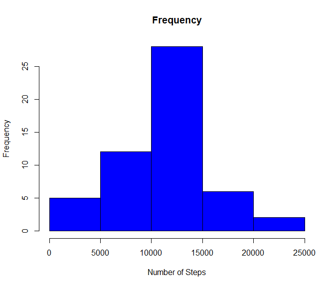
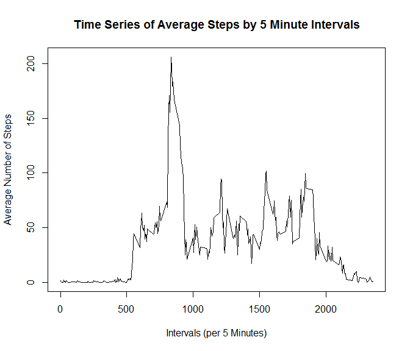
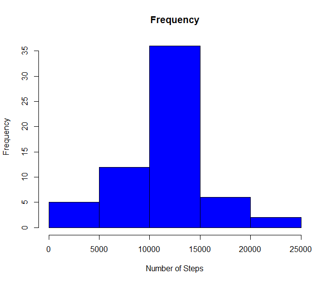
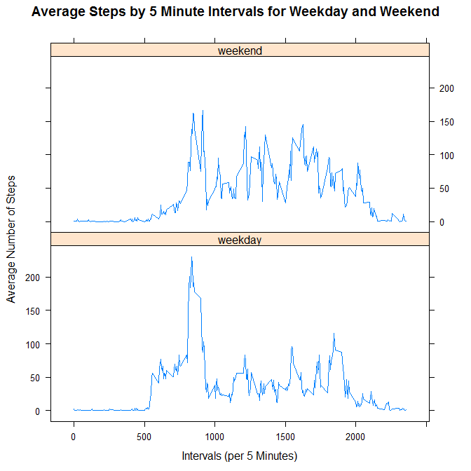

# Reproducible Research: Peer Assessment 1


## Loading and preprocessing the data

Load the data from the working directory
(Using setwd("C:/Users/Toan Vo/Rep_Assignment1/RepData_PeerAssessment1/") to set the working directory to where the data file located)


```r
setwd("C:/Users/Toan Vo/Rep_Assignment1/RepData_PeerAssessment1/")
activ_data <- read.csv("activity.csv")
head(activ_data, 20)
```

```
##    steps       date interval
## 1     NA 2012-10-01        0
## 2     NA 2012-10-01        5
## 3     NA 2012-10-01       10
## 4     NA 2012-10-01       15
## 5     NA 2012-10-01       20
## 6     NA 2012-10-01       25
## 7     NA 2012-10-01       30
## 8     NA 2012-10-01       35
## 9     NA 2012-10-01       40
## 10    NA 2012-10-01       45
## 11    NA 2012-10-01       50
## 12    NA 2012-10-01       55
## 13    NA 2012-10-01      100
## 14    NA 2012-10-01      105
## 15    NA 2012-10-01      110
## 16    NA 2012-10-01      115
## 17    NA 2012-10-01      120
## 18    NA 2012-10-01      125
## 19    NA 2012-10-01      130
## 20    NA 2012-10-01      135
```


## What is mean total number of steps taken per day?

Aggregate the number of steps by date


```r
steps_by_date <- aggregate(activ_data$steps, list(Date =  activ_data$date), sum)
head(steps_by_date)
```

```
##         Date     x
## 1 2012-10-01    NA
## 2 2012-10-02   126
## 3 2012-10-03 11352
## 4 2012-10-04 12116
## 5 2012-10-05 13294
## 6 2012-10-06 15420
```


Plot the histogram of total number of steps taken each day


```r
hist(steps_by_date$x, main="Frequency", col="blue", xlab="Number of Steps")
```

 


Calculate the mean and median of total steps taken per day


```r
mean(steps_by_date$x, na.rm = TRUE)
```

```
## [1] 10766.19
```

```r
median(steps_by_date$x, na.rm = TRUE)
```

```
## [1] 10765
```


## What is the average daily activity pattern?

Aggregate the data by the 5 minute intervals


```r
steps_by_interval <- aggregate(steps ~ interval, activ_data, mean)
head(steps_by_interval)
```

```
##   interval     steps
## 1        0 1.7169811
## 2        5 0.3396226
## 3       10 0.1320755
## 4       15 0.1509434
## 5       20 0.0754717
## 6       25 2.0943396
```


Make a time series plot (i.e. type = "l") of the 5-minute interval (x-axis) and the average number of steps taken, averaged across all days (y-axis)


```r
    plot(
       x = steps_by_interval$interval
      ,y = steps_by_interval$steps
      ,type = "l"
      ,main = "Time Series of Average Steps by 5 Minute Intervals"
      ,xlab = "Intervals (per 5 Minutes)"
      ,ylab = "Average Number of Steps"
      )
```

 


Which 5-minute interval, on average across all the days in the dataset, contains the maximum number of steps?


```r
steps_by_interval[steps_by_interval$steps == max(steps_by_interval$steps),]
```

```
##     interval    steps
## 104      835 206.1698
```


## Imputing missing values

Calculate and report the total number of missing values in the dataset (i.e. the total number of rows with NAs)


```r
nrow(subset(activ_data, is.na(activ_data$steps)))
```

```
## [1] 2304
```


Missing values are to be imputed by simply replacing them with the mean for the corresponding interval, i.e. if missing data is found on interval 25, replace the NA value by the mean of interval 25 across all dates (which is 1.0943396). Note that decimal numbers will be rounded up to the next integer.


```r
imputed_data <- data.frame(activ_data)
indx <- which(is.na(imputed_data$steps))
imputed_data$steps[indx] <- ceiling(tapply(X=imputed_data$steps, INDEX=imputed_data$interval, FUN=mean, na.rm=TRUE))
```


Aggregate steps by date from the imputed data


```r
steps_by_date_imputed <- aggregate(steps ~ date, imputed_data, sum)
```


Create histogram of the total number of steps taken each day on the imputed data.


```r
hist(steps_by_date_imputed$steps, main="Frequency", col="blue", xlab="Number of Steps")
```

 


Calculate and report the mean and median total number of steps taken per day


```r
mean(steps_by_date_imputed$steps)
```

```
## [1] 10784.92
```

```r
median(steps_by_date_imputed$steps)
```

```
## [1] 10909
```


Compare the difference from the imputed estimates to the original data


```r
mean(steps_by_date_imputed$steps) - mean(steps_by_date$x, na.rm = TRUE)
```

```
## [1] 18.72935
```

```r
median(steps_by_date_imputed$steps) - median(steps_by_date$x, na.rm = TRUE)
```

```
## [1] 144
```

```r
sum(steps_by_date_imputed$steps) - sum(steps_by_date$x, na.rm = TRUE)
```

```
## [1] 87272
```

There were 87272 more steps in the imputed data


## Are there differences in activity patterns between weekdays and weekends?

Create a new factor variable in the dataset with two levels - "weekday" and "weekend" indicating whether a given date is a weekday or weekend day


```r
imputed_data$wkdayType <- as.factor(ifelse(weekdays(as.Date(imputed_data$date)) %in% c("Saturday", "Sunday"), "weekend", "weekday"))
head(imputed_data, 20)
```

```
##    steps       date interval wkdayType
## 1      2 2012-10-01        0   weekday
## 2      1 2012-10-01        5   weekday
## 3      1 2012-10-01       10   weekday
## 4      1 2012-10-01       15   weekday
## 5      1 2012-10-01       20   weekday
## 6      3 2012-10-01       25   weekday
## 7      1 2012-10-01       30   weekday
## 8      1 2012-10-01       35   weekday
## 9      0 2012-10-01       40   weekday
## 10     2 2012-10-01       45   weekday
## 11     1 2012-10-01       50   weekday
## 12     1 2012-10-01       55   weekday
## 13     1 2012-10-01      100   weekday
## 14     1 2012-10-01      105   weekday
## 15     1 2012-10-01      110   weekday
## 16     1 2012-10-01      115   weekday
## 17     0 2012-10-01      120   weekday
## 18     2 2012-10-01      125   weekday
## 19     2 2012-10-01      130   weekday
## 20     1 2012-10-01      135   weekday
```


Aggregate the data by intervals and "weekday"/"weekend" types


```r
steps_by_interval_dayType <- aggregate(steps ~ interval + wkdayType, imputed_data, mean)
head(steps_by_interval_dayType)
```

```
##   interval wkdayType     steps
## 1        0   weekday 2.2888889
## 2        5   weekday 0.5333333
## 3       10   weekday 0.2888889
## 4       15   weekday 0.3111111
## 5       20   weekday 0.2222222
## 6       25   weekday 1.7111111
```


Make a panel plot containing a time series plot (i.e. type = "l") of the 5-minute interval (x-axis) and the average number of steps taken, averaged across all weekday days or weekend days (y-axis). 


```r
library("lattice")
xyplot(
       data = steps_by_interval_dayType
      ,steps ~ interval | wkdayType
      ,type = "l"
      ,layout = c(1, 2)
      ,main = "Average Steps by 5 Minute Intervals for Weekday and Weekend"
      ,xlab = "Intervals (per 5 Minutes)"
      ,ylab = "Average Number of Steps"
      )
```

 


